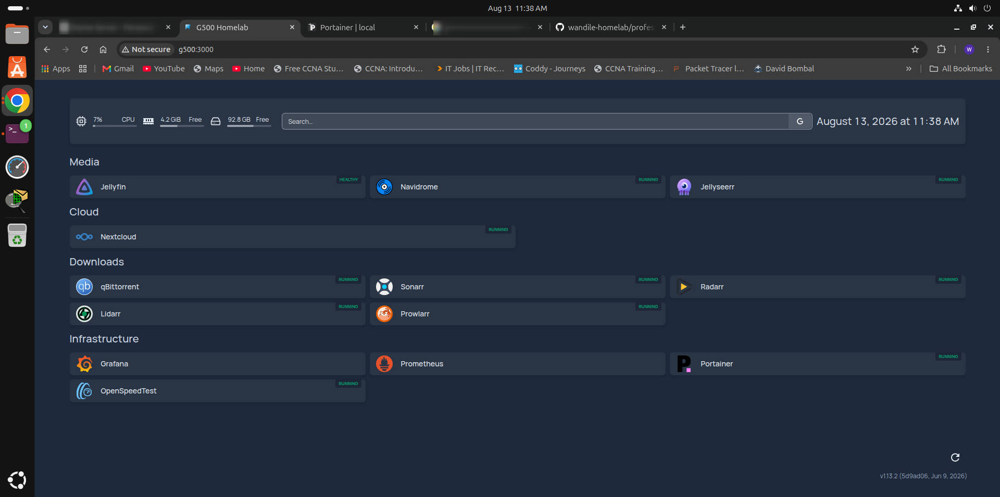
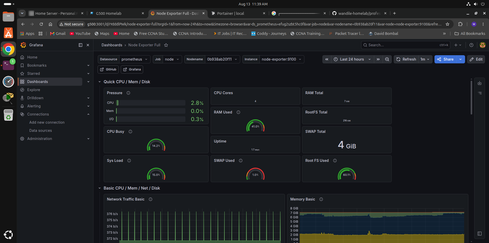
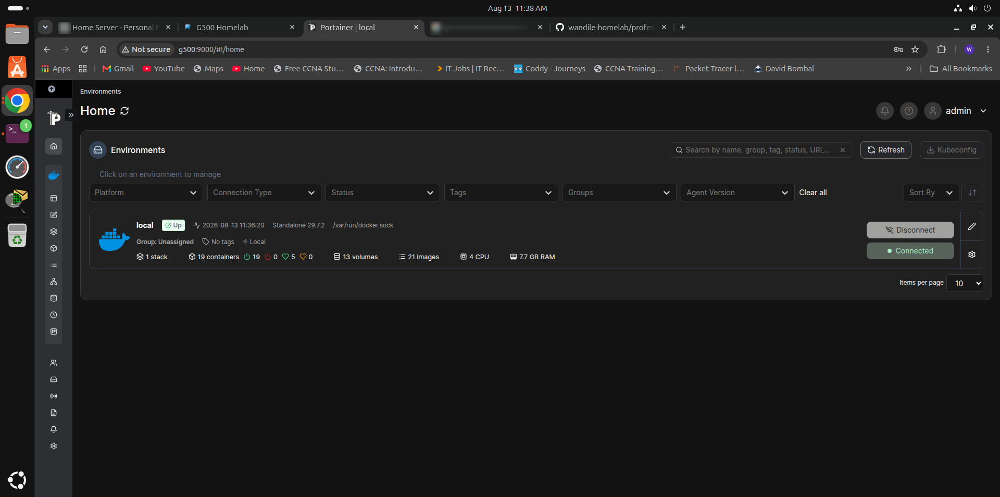
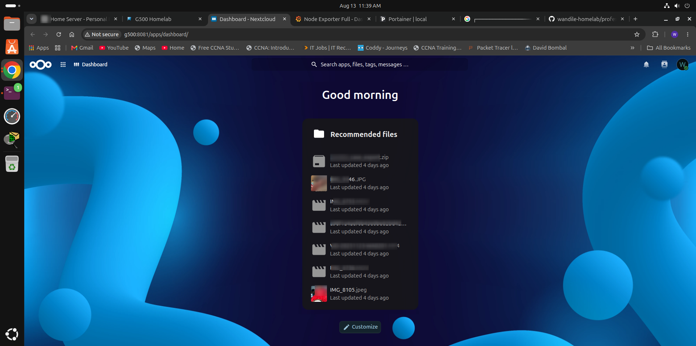
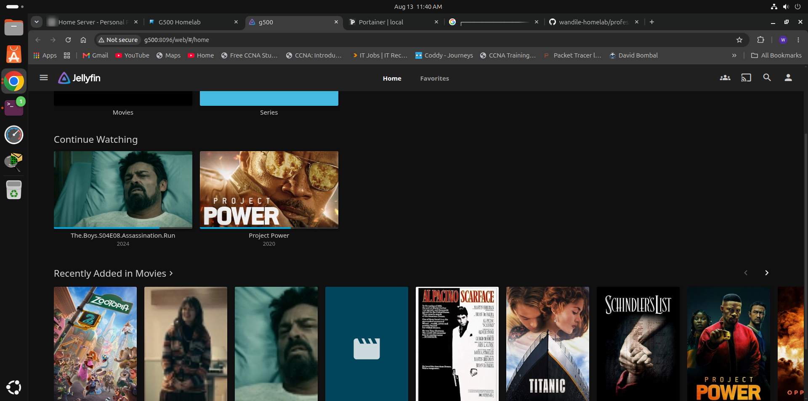

# Wandile's G500 Homelab

> A real-world self-hosted infrastructure lab built, operated, monitored, documented, and maintained on a Lenovo G500 running Ubuntu Server.

## Overview

This repository documents my personal homelab infrastructure and the practical IT skills developed while building and operating it.

The environment is based on a Lenovo G500 server running Ubuntu Server with Docker and Docker Compose. It provides self-hosted cloud storage, media services, automated media management, monitoring, administration tools, remote access, persistent storage, and backup infrastructure.

The project is maintained as a practical technical portfolio demonstrating hands-on experience rather than a theoretical lab.

## Infrastructure

| Component | Role |
|---|---|
| Lenovo G500 | Homelab server |
| Ubuntu Server | Host operating system |
| Docker Engine | Container platform |
| Docker Compose | Service orchestration |
| Git | Version control and infrastructure documentation |
| Tailscale | Remote network access |
| Persistent storage | Application, media, and backup data |
| Prometheus | Metrics collection |
| Grafana | Monitoring and visualization |

## Services

### Cloud & Storage

- **Nextcloud** — self-hosted file and cloud platform
- **PostgreSQL** — Nextcloud database
- **Redis** — Nextcloud caching and session infrastructure

### Media

- **Jellyfin** — media streaming
- **Navidrome** — music streaming

### Media Automation

- **Sonarr** — TV automation
- **Radarr** — movie automation
- **Lidarr** — music automation
- **Prowlarr** — indexer management
- **qBittorrent** — download client
- **Jellyseerr** — media requests
- **FlareSolverr** — browser challenge handling

### Management

- **Portainer** — Docker management
- **Homepage** — service dashboard

### Monitoring

- **Prometheus** — metrics collection
- **Grafana** — monitoring dashboards
- **cAdvisor** — container metrics
- **Node Exporter** — host metrics
- **OpenSpeedTest** — network performance testing

## Screenshots

### Homepage

The central dashboard provides a single interface for accessing the services running across the homelab.



### Grafana

Monitoring dashboards provide visibility into host and container performance.



### Portainer

Portainer provides container and Docker environment management.



### Nextcloud

Nextcloud provides self-hosted cloud storage and file management.



### Jellyfin

Jellyfin provides self-hosted media streaming.



## Architecture

The environment is divided into several functional Compose stacks.

```text
                         G500 HOMELAB
                              |
                    +---------+---------+
                    |                   |
                Ubuntu Server       Tailscale
                    |
                 Docker
                    |
       +------------+-------------+
       |            |             |
     Cloud         Media       Management
       |            |             |
   Nextcloud     Jellyfin      Portainer
   PostgreSQL    Navidrome     Homepage
   Redis         *arr stack
       |
       +-----------------------------+
                                     |
                               Monitoring
                                     |
                         Prometheus + Grafana
                         cAdvisor + Node Exporter

Detailed architecture diagrams are available under professional/diagrams/.

Storage

The server uses separate storage for operating-system and application workloads and larger media and backup workloads.

The storage design separates:

Operating system and application workloads
Persistent Docker configuration
Nextcloud application data
Media libraries
Download storage
Backup storage

The storage design and capacity information are documented in professional/docs/storage.md.

Backup & Disaster Recovery

Backup planning is treated as part of the infrastructure rather than an afterthought.

Priority data includes:

Nextcloud data
Databases
Docker and Compose configuration
Important scripts
Git repository
Application configuration

Replaceable data such as Docker images and re-downloadable media is treated differently.

The backup strategy and restoration considerations are documented in professional/docs/backups.md.

A backup is not considered complete until restoration has been tested.

Monitoring & Operations

The homelab includes dedicated monitoring infrastructure using:

Prometheus
Grafana
cAdvisor
Node Exporter

A custom Bash-based audit tool was also developed to report:

Host uptime and load
Filesystem usage
Docker version
Container status and health
Docker disk usage
Homelab storage usage
Backup status
Git repository state

Example audit output:

=== STORAGE CHECK ===
Root usage: 59%
Storage usage: 49%
[OK] Root filesystem healthy
[OK] Storage filesystem healthy

=== CONTAINER HEALTH ===
Running containers: 19
Healthy:             5
Unhealthy:           0
Starting:            0
No healthcheck:      14

[OK] No unhealthy containers detected

The audit tooling is available under professional/scripts/.

Networking

The server operates on the local network using Ethernet and is remotely accessible through Tailscale.

The environment also uses Docker bridge networks to connect containerized services according to their requirements.

Network documentation and diagrams are available under professional/docs/network.md and professional/diagrams/network.mmd.

Security

Security considerations are incorporated into the project design.

The public repository intentionally excludes:

.env files
Application runtime data
Databases
Private keys
Certificates
Backup contents
Personal files
Docker runtime data

Environment configuration is represented using safe example files such as env/cloud.env.example.

Repository security checks are also documented as part of the project workflow.

Troubleshooting & Incident Documentation

This project includes documentation of real infrastructure incidents and the troubleshooting process used to resolve them.

Examples include:

Storage and boot issues
Music library migration
Nextcloud encrypted-storage issues

Incident reports are available under professional/incidents/.

This provides a record of not only the final configuration, but also the diagnostic and problem-solving process behind it.

Documentation

Detailed technical documentation is available under professional/.

Documentation includes
Architecture
Backups & Disaster Recovery
Docker
Hardware
Monitoring
Network
Operations Runbook
Security
Services
Storage
Troubleshooting
Audit Process
Job Portfolio
Skills Demonstrated

This project has provided practical experience with:

Linux
Ubuntu Server administration
Filesystems and storage
Permissions and ownership
System monitoring
Service management
Command-line troubleshooting
Bash scripting
Docker
Docker Engine
Docker Compose
Containers
Images
Volumes
Networks
Persistent application data
Container health monitoring
Networking
LAN configuration
Ethernet networking
Docker bridge networking
Tailscale
Remote administration
Service connectivity troubleshooting
Infrastructure
Infrastructure organization
Service deployment
Persistent storage design
Monitoring
Backup planning
Disaster recovery planning
Incident documentation
Development & Version Control
Git
GitHub
Bash
YAML
Environment configuration
Infrastructure documentation
Repository Structure
.
├── compose/              # Docker Compose service definitions
├── docker/               # Custom Docker build configuration
├── env/                  # Safe environment examples
├── professional/
│   ├── diagrams/         # Architecture and infrastructure diagrams
│   ├── docs/             # Technical documentation
│   ├── incidents/        # Real troubleshooting incident reports
│   ├── scripts/          # Audit and administration scripts
│   └── screenshots/      # Infrastructure screenshots
├── README.md
└── .gitignore
Project Philosophy

The goal of this homelab is not simply to run services.

It is an environment for learning how infrastructure behaves in the real world:

Build
  ↓
Configure
  ↓
Monitor
  ↓
Break
  ↓
Troubleshoot
  ↓
Document
  ↓
Improve
  ↓
Back up
  ↓
Test recovery

The project therefore includes configuration, operational documentation, monitoring, incident reports, and automation alongside the services themselves.

Portfolio

This repository represents a practical technical portfolio demonstrating hands-on experience with:

IT support
Linux administration
Docker and containerization
Networking
Storage administration
Monitoring
Backup and recovery
Troubleshooting
Infrastructure documentation
Git and GitHub

The environment is continuously maintained and improved as I develop my Linux, networking, infrastructure, and automation skills.

Built and maintained by Wandile.
